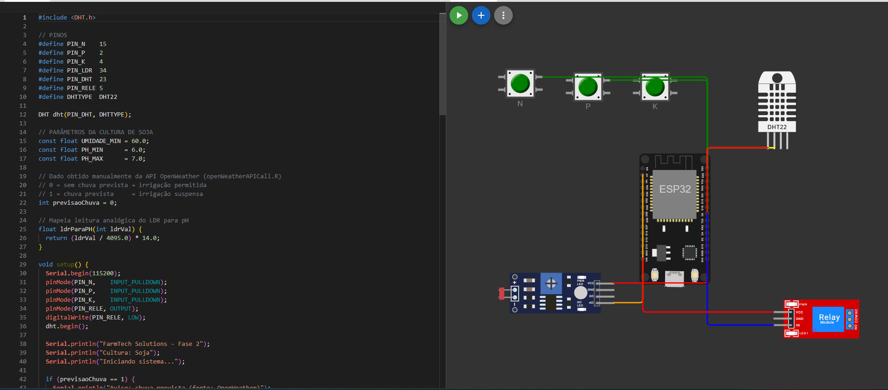

# FIAP - Faculdade de Informática e Administração Paulista

 

# 🚀 FASE 02 — Campo da Inovação - uma plantação de códigos
## 📚 Graduação ON em Inteligência Artificial

---

# GRUPO ACADÊMICO IA

## 👨‍🎓 Integrantes:
Andrews Oliveira

Arthur Camacho

Esther Barreto

Lucas Ramalho Paiva

Maria Carolina Tozelli

## 👩‍🏫 Professores:

### Tutor(a)
Sabrina Otoni

### Coordenador(a)
André Godoi

## 🛠 Tecnologias Utilizadas

Durante esta fase, foram utilizadas as seguintes tecnologias:

- C/C++
- Python
---

## 📂 Projetos Desenvolvidos

### 📌 Projeto 1 — Sistema de Irrigação Inteligente com ESP32

**Descrição:**  
🌱 Projeto: Sistema de Irrigação Inteligente com ESP32 (Simulação Wokwi)

O projeto Sistema de Irrigação Inteligente foi desenvolvido com o objetivo de simular uma solução tecnológica aplicada ao agronegócio, voltada à automação da irrigação em lavouras. A proposta está inserida no contexto da Agricultura Digital (Agrotech), buscando demonstrar como sensores e microcontroladores podem ser utilizados para otimizar o uso de recursos hídricos e melhorar a produtividade agrícola.

A simulação foi desenvolvida na plataforma Wokwi utilizando o microcontrolador ESP32 como unidade central de processamento, responsável por coletar os dados dos sensores e controlar o sistema de irrigação.

O sistema tem como principal finalidade automatizar o processo de irrigação com base em variáveis ambientais e químicas do solo, simulando condições reais enfrentadas em uma lavoura.

A lógica do projeto considera os seguintes fatores:

- Níveis de nutrientes do solo (Nitrogênio, Fósforo e Potássio – NPK)
- pH do solo
- Umidade
- Temperatura
- Previsão climática (chuva)

A partir desses dados, o sistema toma decisões automáticas sobre ligar ou desligar a irrigação, representada por um relé (bomba d’água).

  
</a>

#### Organização dos Componentes

A arquitetura do circuito está dividida em quatro blocos principais

- ##### Sensores de Nutrientes (NPK)

Na parte superior esquerda da simulação, estão posicionados três botões:

N (Nitrogênio)
P (Fósforo)
K (Potássio)

Cada botão está conectado a um pino digital do ESP32 com INPUT_PULLDOWN, garantindo que:

Botão pressionado → nível adequado do nutriente
Botão solto → nível baixo do nutriente

Essa abordagem simula sensores agrícolas de forma didática.

- ##### Sensor de Umidade e Temperatura (DHT22)

Localizado na parte superior direita:

Conectado a um pino digital do ESP32
Responsável por fornecer:
Umidade (%)
Temperatura (°C)

Apesar de ser um sensor de ar, ele foi adaptado para representar a umidade do solo no contexto da simulação.

- ##### Sensor de pH (via LDR)

Na parte inferior esquerda, observa-se o módulo com ajuste (trimpot), representando o sensor:

O LDR (sensor de luz) está conectado a um pino analógico do ESP32
Seu valor (0–4095) é convertido em escala de pH (0 a 14)

Essa conversão permite simular diferentes condições do solo:

Valores próximos de 7 → pH neutro
Valores baixos → solo ácido
Valores altos → solo alcalino

- ##### Atuador - Relé (Bomba de Irrigação)

Na parte inferior direita:

Módulo de relé azul conectado ao ESP32
Controlado por um pino digital de saída

Função:

Ligado (HIGH) → ativa a irrigação
Desligado (LOW) → interrompe a irrigação

#### Fluxo de Funcionamento do Sistema

1. O ESP32 realiza a leitura contínua:
    - Botões (NPK)
    - Sensor DHT22 (umidade e temperatura)
    - Sensor LDR (pH)
2. Os dados são processados internamente:
    - Conversão do LDR → pH
    - Validação dos valores do DHT22
3. O sistema aplica a lógica de decisão:
    - Verifica umidade do solo
    - Avalia faixa de pH
    - Analisa presença de nutrientes
    - Considera a previsão de chuva obtida por meio de uma chamada à API de condições climáticas realizada em Python; quando há previsão de chuva, o sistema recebe o valor 1, caso contrário, 0.
4. O relé é acionado:
    - Liga a bomba se todas as condições forem favoráveis
    - Desliga a bomba caso contrário

**Tecnologias utilizadas:**  
- ESP32
- C/C++  

---

### 📌 Projeto 2 — API de Condições Climáticas com Python

**Descrição:**  

O projeto API de Condições Climáticas com Python foi desenvolvido com o objetivo de integrar dados meteorológicos em tempo real ao sistema de irrigação inteligente, tornando a tomada de decisão mais precisa e automatizada.

A solução realiza requisições a uma API pública da OpenWeather para verificar a previsão de chuva em uma determinada localidade. Com base na resposta obtida, o sistema retorna:

1 → há previsão de chuva
0 → não há previsão de chuva

Essa informação é utilizada diretamente na lógica do sistema de irrigação, evitando acionamentos desnecessários da bomba quando há precipitação prevista, contribuindo para economia de recursos e maior eficiência operacional.

#### Fluxo de Funcionamento

O funcionamento do sistema segue as seguintes etapas:

1. #### Entrada do Usuário

O usuário informa o nome da cidade que deseja consultar.

2. #### Geolocalização da Cidade

A partir do nome informado, o sistema realiza uma requisição HTTP para a API de geolocalização da OpenWeather, que retorna:

Latitude
Longitude

Essas informações são essenciais para consultas meteorológicas mais precisas.

Caso a API não retorne dados ou a resposta seja inválida, o sistema exibe uma mensagem de erro ao usuário.
Caso contrário, o fluxo segue para a próxima etapa.

3. #### Consulta das Condições Climáticas

Utilizando a latitude e longitude obtidas, o sistema realiza uma nova requisição para a API de clima da OpenWeather, que retorna dados detalhados da região.

Em caso de falha na requisição ou dados inconsistentes, o sistema trata o erro adequadamente.
Em caso de sucesso, os dados são processados para extração das informações relevantes.

4. #### Análise da Resposta da API

O sistema acessa o campo:

"weather" → lista de condições climáticas
"main" → descrição principal do clima

A partir dessa informação, é feita a seguinte verificação:

Se o valor retornado for "Rain" → indica chuva → retorna 1
Caso contrário → retorna 0

#### Integração com o Sistema de Irrigação

O valor retornado pela API é utilizado como variável de decisão no sistema embarcado (ESP32):

1 (chuva prevista) → irrigação bloqueada
0 (sem chuva) → irrigação permitida

Essa integração permite que o sistema evolua de um modelo puramente reativo (baseado apenas em sensores locais) para um modelo inteligente e preditivo, incorporando dados externos.

💡 Tecnologias Utilizadas
Python 3.x
Requisições HTTP (requests ou equivalente)
API OpenWeather (Geocoding + Weather)
Manipulação de JSON

**Tecnologias utilizadas:**  
- Python 3.14
- Requisições HTTP (requests)
- API OpenWeather (Geocoding + Weather)
- Serialização de JSON (json)

---

## 📋 Licença

<a property="dct:title" rel="cc:attributionURL" href="https://github.com/SabrinaOtoni/TEMPLATE-FIAP-GRAD-ON-IA">MODELO GIT FIAP</a> por <a rel="cc:attributionURL dct:creator" property="cc:attributionName" href="https://fiap.com.br">FIAP</a> está licenciado sobre <a href="http://creativecommons.org/licenses/by/4.0/?ref=chooser-v1" target="_blank" rel="license noopener noreferrer" style="display:inline-block;">Attribution 4.0 International</a>.
