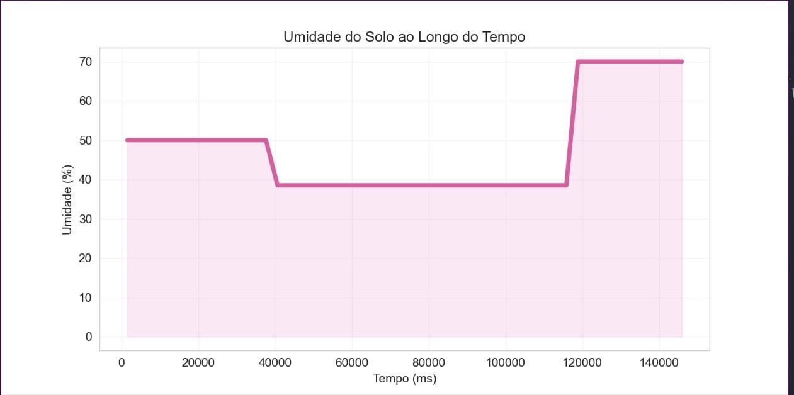
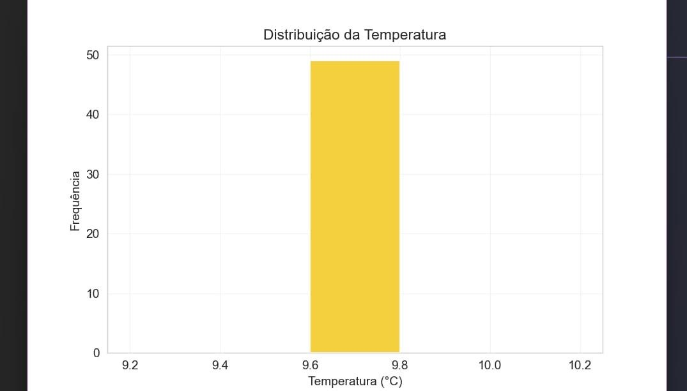
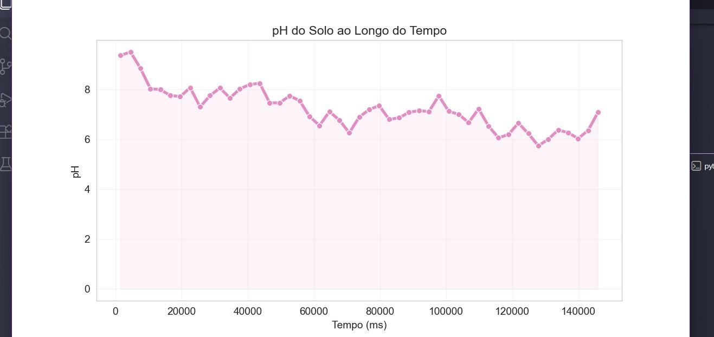
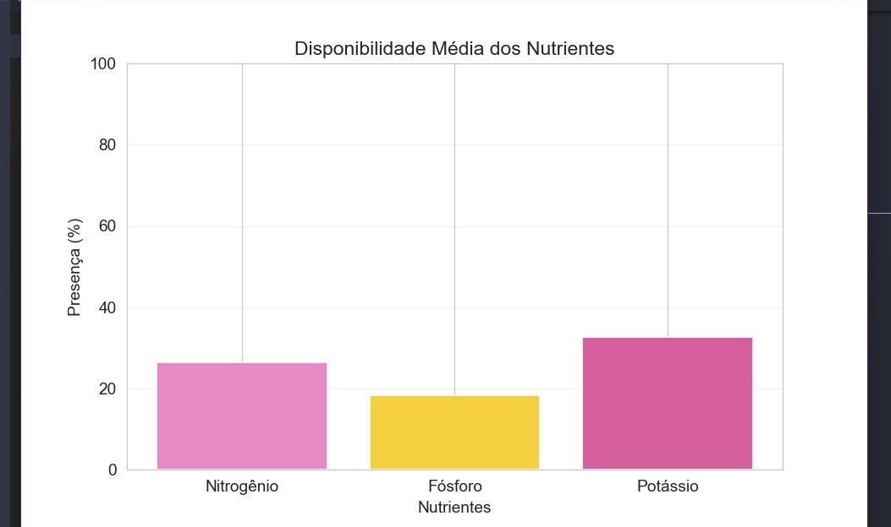
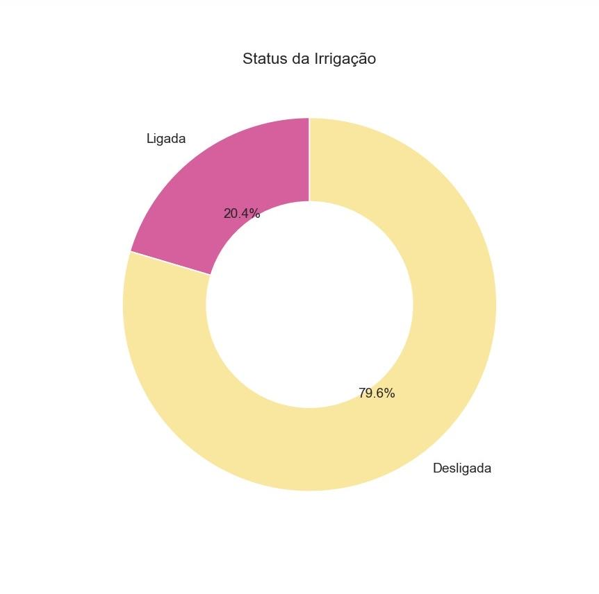

# FIAP - Faculdade de Informática e Administração Paulista

<p align="center">
<a href="https://www.fiap.com.br/">
  
</a>
</p>

<br>

# 🚀 FASE 03 — Etapas de uma Máquina Agrícola
## 📚 Graduação ON em Inteligência Artificial

---

# GRUPO ACADÊMICO IA

## 👨‍🎓 Integrantes:
Andrews Oliveira

Arthur Camacho

Esther Barreto

Lucas Ramalho Paiva

Maria Carolina Tozelli

## 👩‍🏫 Professores:

### Tutor(a)
Sabrina Otoni

### Coordenador(a)
André Godoi

## 🛠 Tecnologias Utilizadas

Durante esta fase, foram utilizadas as seguintes tecnologias:

- C/C++
- Python
- SQL (Oracle)
- Jupyter Notebook

---

## 📂 Projetos Desenvolvidos

### 📌 Entrega Obrigatória — Banco de Dados Oracle com Dados do ESP32

## 🎥 Vídeo de Apresentação

Assista à apresentação completa do projeto no YouTube:

[](https://www.youtube.com/watch?v=nGF0WKMNRfs)

**Descrição:**

Esta entrega dá continuidade ao sistema de irrigação inteligente desenvolvido na Fase 2. O circuito ESP32 foi evoluído para exportar os dados dos sensores diretamente no formato CSV via monitor serial, possibilitando a importação dessas leituras para um banco de dados relacional Oracle por meio do Oracle SQL Developer.

As principais evoluções em relação à Fase 2 foram:

- **Saída de dados em CSV:** o monitor serial passou a emitir um cabeçalho de colunas seguido de linhas de dados separadas por vírgulas, prontas para importação em banco de dados.

---

#### 🔌 Circuito Wokwi — Sistema de Irrigação Inteligente (Fase 3)

Acesse a simulação completa:

[](https://wokwi.com/projects/464315709910537217)

O circuito mantém os mesmos componentes da Fase 2, organizados em quatro blocos:

| Componente | Pino ESP32 | Função |
|---|---|---|
| Botão N (Nitrogênio) | D15 | Indica presença de nitrogênio no solo |
| Botão P (Fósforo) | D2 | Indica presença de fósforo no solo |
| Botão K (Potássio) | D4 | Indica presença de potássio no solo |
| LDR (Fotoresistor) | VP (34) | Simula sensor de pH — leitura 0–4095 convertida para escala 0–14 |
| DHT22 | D23 | Mede umidade (%) e temperatura (°C) |
| Módulo Relé | D5 | Controla a bomba d'água (irrigação) |

**Parâmetros da cultura (Soja):**

| Parâmetro | Valor |
|---|---|
| Umidade mínima | 60% |
| pH mínimo | 6,0 |
| pH máximo | 7,0 |

**Lógica de decisão da bomba:**

A bomba é ativada apenas quando **todas** as condições abaixo são verdadeiras simultaneamente:

- Solo seco (umidade < 60%)
- pH dentro da faixa ideal (6,0 – 7,0)
- Pelo menos um nutriente (N, P ou K) com nível baixo
- Sem previsão de chuva (`previsao_chuva == 0`)

**Formato CSV exportado via Serial:**

```
tempo_ms,nitrogenio,fosforo,potassio,ldr,ph,umidade,temperatura,previsao_chuva,bomba
```

---

#### 🗄️ Importação no Oracle SQL Developer

O arquivo CSV gerado pela simulação Wokwi foi importado para o banco de dados Oracle FIAP seguindo os passos abaixo:

**Configuração da conexão:**

| Campo | Valor |
|---|---|
| Nome do usuário | RM + número (ex: RM12345) |
| Senha | Data de nascimento no formato DDMMYY |
| Host | oracle.fiap.com.br |
| Porta | 1521 |
| SID | ORCL |

**Passos realizados:**

1. Conexão estabelecida com o banco Oracle FIAP.
2. Acesso ao item "Tabelas (Filtrado)" no painel de conexões.
3. Clique com botão direito → "Importar Dados".
4. Carregamento do arquivo CSV gerado pelo ESP32.
5. Definição do nome da tabela e mapeamento das colunas.
6. Finalização da importação com confirmação de sucesso.
7. Execução de `SELECT * FROM NOME_DA_TABELA;` para validação dos dados importados.

---

#### 📋 Consultas SQL Realizadas

**Consulta completa — todos os registros:**

```sql
SELECT * FROM NOME_DA_TABELA;
```


---

**Registros com irrigação ativa (bomba = 1):**

```sql
SELECT * FROM NOME_DA_TABELA WHERE bomba = 1;
```


---

**Registros com irrigação inativa (bomba = 0):**

```sql
SELECT * FROM NOME_DA_TABELA WHERE bomba = 0;
```


---

**Médias das variáveis monitoradas:**

```sql
SELECT AVG(umidade), AVG(ph) FROM NOME_DA_TABELA;
```


---

**Tecnologias utilizadas:**
- ESP32
- C/C++
- Oracle SQL Developer
- SQL

---

### 📌 Ir Além 01 (Opcional) — Dashboard de Visualização em Python

**Descrição:**

Com os dados coletados pelo ESP32 e exportados em CSV, foi desenvolvida uma dashboard estática utilizando `matplotlib` e `seaborn` para visualizar as variáveis monitoradas durante a simulação.

O script processa o arquivo `dados_esp32.csv`, valida as colunas necessárias, converte os tipos de dados e exibe cinco gráficos cobrindo as principais variáveis do sistema:

| # | Gráfico | Tipo | Variável |
|---|---|---|---|
| 1 | Umidade do Solo ao Longo do Tempo | Linha com preenchimento | `UMIDADE` × `TEMPO_MS` |
| 2 | Distribuição da Temperatura | Histograma | `TEMPERATURA` |
| 3 | pH do Solo ao Longo do Tempo | Linha com marcadores | `PH` × `TEMPO_MS` |
| 4 | Disponibilidade Média dos Nutrientes | Barras | `NITROGENIO`, `FOSFORO`, `POTASSIO` |
| 5 | Status da Irrigação | Pizza (donut) | `BOMBA` (ligada vs. desligada) |

Além dos gráficos, o script imprime no terminal um **resumo** com umidade atual, temperatura média, pH médio e total de registros com irrigação ativa. Ao final, exibe uma **sugestão automática de irrigação** baseada na última leitura de umidade e previsão de chuva.

**Como executar:**

```bash
pip install pandas matplotlib seaborn
python dashboard.py
```

> O arquivo `dados_esp32.csv` deve estar no mesmo diretório do script.

---

**📸 Prints — Gráficos da Dashboard**

**Umidade do Solo ao Longo do Tempo:**



---

**Distribuição da Temperatura:**



---

**pH do Solo ao Longo do Tempo:**



---

**Disponibilidade Média dos Nutrientes:**



---

**Status da Irrigação:**



---

**Tecnologias utilizadas:**
- Python 3.x
- pandas
- matplotlib
- seaborn

---

### 📌 Ir Além 02 (Opcional) — Machine Learning no Agronegócio

**Descrição:**

Esta entrega analisa a base `produtos_agricolas.csv`, que contém 2.200 registros de condições de solo e clima associados a 22 culturas distintas, com distribuição perfeitamente balanceada (100 registros por cultura). O objetivo é identificar o perfil ideal de solo e clima para culturas selecionadas e comparar cinco algoritmos de classificação.

**Variáveis preditoras:** N, P, K, temperature, humidity, ph, rainfall

**Variável alvo:** `label` (cultura recomendada)

---

#### 🔍 Análise Exploratória (EDA)

Foram produzidos 11 gráficos ao longo do notebook, distribuídos entre as etapas de exploração, perfil por cultura e avaliação dos modelos:

| Gráfico | Descrição |
|---|---|
| 1 | Quantidade de registros por cultura |
| 2 | Distribuição das variáveis de solo e clima |
| 3 | Matriz de correlação entre variáveis numéricas |
| 4 | Comparação das condições climáticas e pH por cultura |
| 5 | Média dos nutrientes (N, P, K) por cultura |
| 6 | Umidade × precipitação para arroz, milho e café |
| 7 | Comparação padronizada contra o perfil geral (heatmap) |
| 8 | Radar de desvios por cultura em relação ao perfil geral |
| 9 | Comparação das métricas dos modelos no conjunto de teste |
| 10 | Matriz de confusão do melhor modelo (Random Forest) |
| 11 | Importância das variáveis no Random Forest |

---

#### 🌱 Perfil Ideal de Solo e Clima

Três culturas foram comparadas contra o perfil geral da base (desvios em desvios-padrão):

| Cultura | Destaques acima da média | Destaques abaixo da média |
|---|---|---|
| **Arroz** | Precipitação (+2,41 dp), Umidade (+0,48 dp), Nitrogênio (+0,79 dp) | Temperatura (-0,38 dp) |
| **Milho** | Nitrogênio (+0,74 dp) | Potássio (-0,56 dp), Temperatura (-0,64 dp), Umidade (-0,29 dp) |
| **Café** | Nitrogênio (+1,37 dp), pH (+0,41 dp), Precipitação (+0,99 dp) | Fósforo (-0,75 dp), Umidade (-0,57 dp) |

---

#### 🤖 Modelos Preditivos

Cinco algoritmos foram treinados com separação treino/teste estratificada (80%/20%) e validação cruzada de 5 folds no conjunto de treino:

| Modelo | Acurácia CV (média) | Acurácia Teste | F1 Macro Teste |
|---|---|---|---|
| **Random Forest** ⭐ | 99,38% | **99,32%** | **0,9932** |
| SVM RBF | 98,24% | 98,86% | 0,9887 |
| Árvore de Decisão | 98,52% | 97,95% | 0,9794 |
| KNN | 96,53% | 97,95% | 0,9793 |
| Regressão Logística | 96,82% | 97,27% | 0,9725 |

O **Random Forest** foi o melhor modelo em todas as métricas avaliadas. As variáveis mais importantes identificadas pelo modelo foram `rainfall` (precipitação) e `humidity` (umidade).

**Notebook:** `ir-alem_02_machine-learning-no-agronegocio/AndrewsOliveira_RM572311_fase3_cap10.ipynb`

---

**📸 Prints — Gráficos do Notebook e Resultados dos Modelos**

> *(Adicionar prints aqui)*

---

**Tecnologias utilizadas:**
- Python 3.x
- pandas, numpy
- matplotlib, seaborn
- scikit-learn (Logistic Regression, KNN, SVM RBF, Decision Tree, Random Forest)
- Jupyter Notebook

---

## 📋 Licença

<p xmlns:cc="http://creativecommons.org/ns#" xmlns:dct="http://purl.org/dc/terms/"><a property="dct:title" rel="cc:attributionURL" href="https://github.com/SabrinaOtoni/TEMPLATE-FIAP-GRAD-ON-IA">MODELO GIT FIAP</a> por <a rel="cc:attributionURL dct:creator" property="cc:attributionName" href="https://fiap.com.br">FIAP</a> está licenciado sobre <a href="http://creativecommons.org/licenses/by/4.0/?ref=chooser-v1" target="_blank" rel="license noopener noreferrer" style="display:inline-block;">Attribution 4.0 International</a>.</p>
