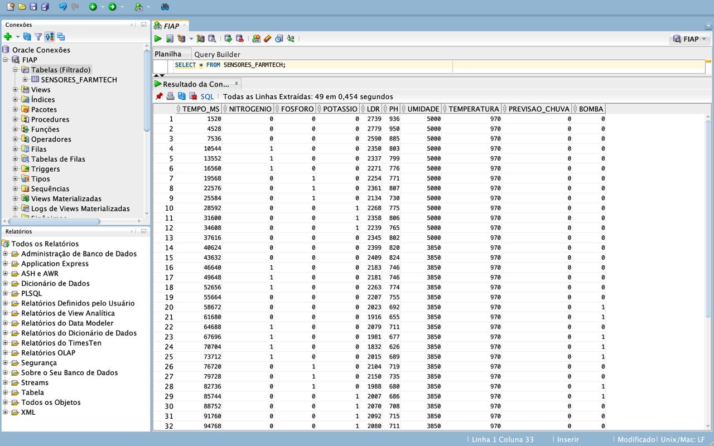
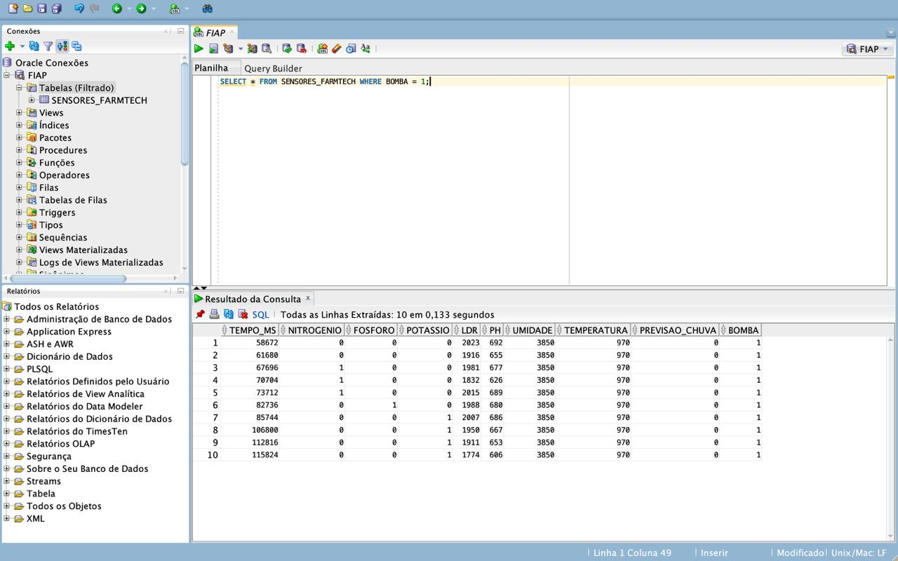
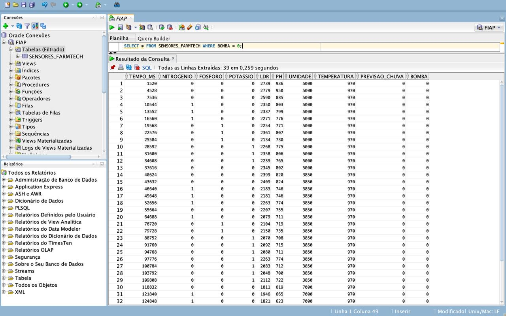
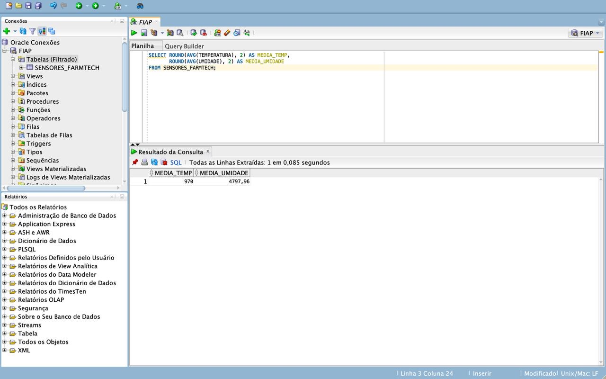

# FIAP - Faculdade de Informática e Administração Paulista

<p align="center">
<a href="https://www.fiap.com.br/">
  
</a>
</p>

<br>

# 📄 Relatório — Carga de Dados no Banco Oracle
## Fase 3 — Etapas de uma Máquina Agrícola
### 📚 Graduação ON em Inteligência Artificial | GRUPO ACADÊMICO IA

---

## 1. Introdução

Este relatório documenta o processo de importação dos dados coletados pelo sistema de irrigação inteligente (desenvolvido na Fase 2) para um banco de dados relacional Oracle, utilizando o Oracle SQL Developer. O objetivo é demonstrar que os dados produzidos pelos sensores do ESP32 podem ser armazenados, consultados e analisados em um ambiente de banco de dados relacional.

---

## 2. Origem dos Dados

Os dados utilizados nesta etapa foram gerados pelo circuito ESP32 simulado na plataforma Wokwi durante a Fase 2 e evoluído na Fase 3. O sistema coleta continuamente leituras de sensores de solo e clima, e na versão da Fase 3 passou a exportar essas leituras diretamente no formato CSV via monitor serial.

**Formato do arquivo CSV gerado:**

```
tempo_ms,nitrogenio,fosforo,potassio,ldr,ph,umidade,temperatura,previsao_chuva,bomba
```

**Descrição das colunas:**

| Coluna | Tipo | Descrição |
|---|---|---|
| `tempo_ms` | Inteiro | Tempo decorrido desde o início da simulação (ms) |
| `nitrogenio` | Booleano (0/1) | Presença de nitrogênio no solo |
| `fosforo` | Booleano (0/1) | Presença de fósforo no solo |
| `potassio` | Booleano (0/1) | Presença de potássio no solo |
| `ldr` | Inteiro (0–4095) | Leitura analógica bruta do sensor de pH |
| `ph` | Decimal | pH calculado a partir do LDR (escala 0–14) |
| `umidade` | Decimal | Umidade do solo em % (sensor DHT22) |
| `temperatura` | Decimal | Temperatura em °C (sensor DHT22) |
| `previsao_chuva` | Booleano (0/1) | Previsão de chuva obtida via API OpenWeather |
| `bomba` | Booleano (0/1) | Estado da bomba de irrigação (1 = ligada) |

---

## 3. Configuração do Ambiente

### 3.1 Oracle SQL Developer

Ferramenta utilizada para estabelecer a conexão com o banco Oracle da FIAP e realizar a importação do CSV.

**Dados de conexão utilizados:**

| Campo | Valor |
|---|---|
| Nome do usuário | RM + número do aluno |
| Senha | Data de nascimento (formato DDMMYY) |
| Host | oracle.fiap.com.br |
| Porta | 1521 |
| SID | ORCL |

---

## 4. Passos Realizados

### 4.1 Importação do CSV para o Oracle

1. Conexão estabelecida com o banco Oracle FIAP via Oracle SQL Developer.
2. No painel de conexões, localizado o item **"Tabelas (Filtrado)"**.
3. Clique com botão direito → **"Importar Dados"**.
4. Selecionado o arquivo CSV gerado pelo ESP32 via botão **"Procurar"**.
5. Definido o nome da tabela como **`SENSORES_FARMTECH`**.
6. Realizado o mapeamento das colunas (sem alterações, todos os campos importados).
7. Clique em **"Finalizar"** — importação concluída com sucesso.

### 4.2 Validação e Consultas

Com os dados carregados, foram executadas as seguintes consultas SQL para validação e análise dos registros:

---

**Consulta 1 — Todos os registros da tabela:**

```sql
SELECT * FROM SENSORES_FARMTECH;
```



---

**Consulta 2 — Registros com irrigação ativa (bomba ligada):**

```sql
SELECT * FROM SENSORES_FARMTECH WHERE bomba = 1;
```



---

**Consulta 3 — Registros com irrigação inativa (bomba desligada):**

```sql
SELECT * FROM SENSORES_FARMTECH WHERE bomba = 0;
```



---

**Consulta 4 — Médias das variáveis monitoradas:**

```sql
SELECT AVG(umidade), AVG(ph) FROM SENSORES_FARMTECH;
```



---

## 5. Conclusão

Os dados coletados pelo sistema de irrigação inteligente do ESP32 foram importados com sucesso para o banco de dados Oracle da FIAP, tornando-os persistentes e consultáveis via SQL. As consultas realizadas demonstram que é possível filtrar registros por estado da bomba e calcular métricas agregadas como médias de umidade e pH, o que abre caminho para análises mais aprofundadas dos dados agrícolas coletados em campo.

---

## 📋 Licença

<p xmlns:cc="http://creativecommons.org/ns#" xmlns:dct="http://purl.org/dc/terms/"><a property="dct:title" rel="cc:attributionURL" href="https://github.com/SabrinaOtoni/TEMPLATE-FIAP-GRAD-ON-IA">MODELO GIT FIAP</a> por <a rel="cc:attributionURL dct:creator" property="cc:attributionName" href="https://fiap.com.br">FIAP</a> está licenciado sobre <a href="http://creativecommons.org/licenses/by/4.0/?ref=chooser-v1" target="_blank" rel="license noopener noreferrer" style="display:inline-block;">Attribution 4.0 International</a>.</p>
